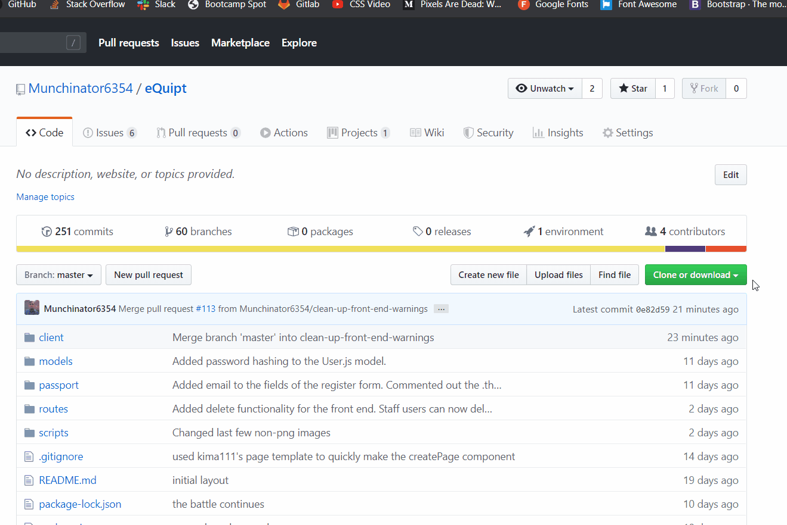
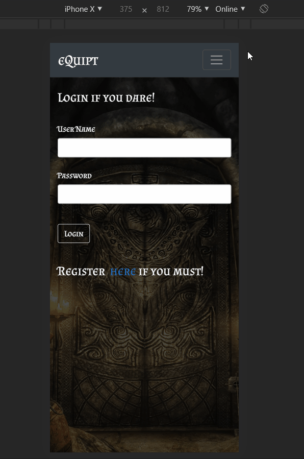

# eQuipt - An app for the LARPing community

## Introduction

eQuipt is an app intended to enable the LARP (live action role play) community to enjoy their roleplay without the complications that pen and paper involve. Traditionally players would have to carry around physical paper cards with their "items" written down, which could possibly be misplaced, stolen, destroyed, etc. With the digitization of this information, the player can wander about, questing and exploring in a bit more care-free manner. It also adds the ability for staff and admin users to both create items and also keep better tabs on items, such as where items exist, how many there are, and who has what within their community.

## How do I get my hands on the code?

Step 1: Navigate to https://github.com/Munchinator6354/eQuipt

Step 2: Clone the repository

Step 3: Navigate to the app's main directory and install node module dependencies on both the client and server side by running "npm i"

Step 4: Run "npm start" within the main directory

Your app should now be running in your browser on <http://localhost:3000>.

## Deployment (Tethered to Heroku)

To deploy, simply add and commit your changes to GitHub. These will will be reviewed by the original team and authorized or requested for review as they see fit. This app is deployed currently on Heroku. As the GitHub master branch is updated, it will automatically update the deployed Heroku version.

To view the Heroku app page, see here: https://larp-equipt.herokuapp.com/

## How does the app function for end-users?

Step 1: Registering a New User - (Pictured showing mobile ready viewing)

Step 2: Logging In

Step 3: Forging a new item type into existence (Admin users only)  

  

Step 4: Creating a New Item (Staff & Admin users Only)  
*Below gif for creating an item is deprecated, in the latest version 3.14 staff users select from a pre-determined list of items previously generated by Admin users*  

Step 5: Viewing Inventory Page (Any user)

Step 6: Giving Items (Any user)

## Technologies Used
This app has been coded in Javascript, React.js is used as the frontend framework. Redux.js was used to manage state. Bcrypt.js was used for password hashing. Passport.js is implemented for user authentication. Node.js, Mongoose.js (ODM), and MongoDB are used for backend data management. Movement on page load brought to you by Sass. Light use of regular expressions (Regex) was included. Lastly, written to be mobile friendly, we have implemented Service Workers to enable an "offline" viewing of user inventory via mobile phone.

https://developer.mozilla.org/en-US/docs/Web/JavaScript  
https://reactjs.org/  
https://redux.js.org/  
https://www.npmjs.com/package/bcryptjs  
http://www.passportjs.org/  
https://nodejs.org/en/  
https://mongoosejs.com/  
https://www.mongodb.com/  
https://sass-lang.com/documentation  
https://developer.mozilla.org/en-US/docs/Web/JavaScript/Guide/Regular_Expressions  
https://developers.google.com/web/fundamentals/primers/service-workers  

## Authors:
https://github.com/kima111 - Abe Kim  
https://github.com/jsills3110 - Jessica Sills  
https://github.com/neverage84 - Noelle Everage  
https://github.com/Munchinator6354 Ryan Isaacson  

## And Finally...
If you have never tried LARPing before, embrace your inner thirst for endless questing with friends and do a Google search for LARP events in your area. Don't forget to use eQuipt to enhance your experience when you do, you'll be happy you did.